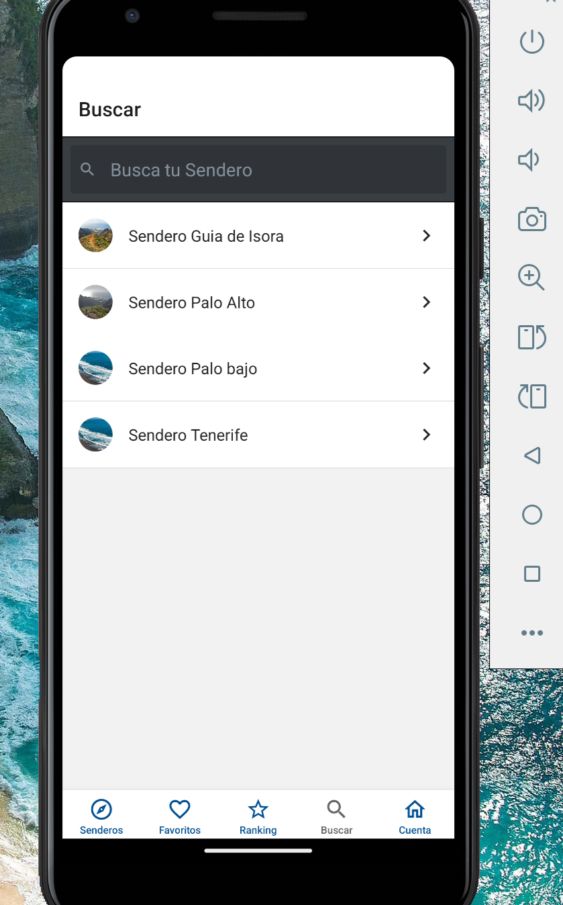
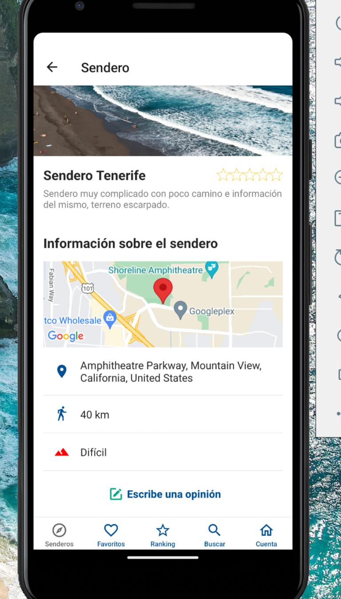
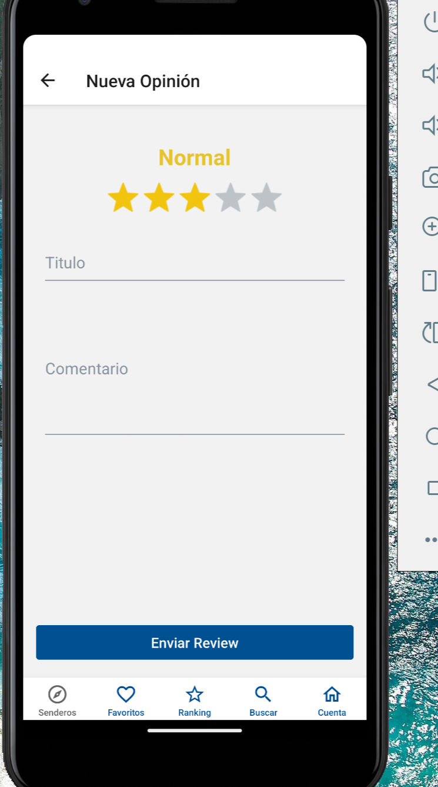

# Proyecto Tenerife Trails


**Tenerife Trails** es una aplicación móvil desarrollada en React Native utilizando Expo. Esta aplicación está diseñada para facilitar la exploración de rutas de senderismo y actividades al aire libre, pudiendo añadir rutas nuevas y comentar aquellas que se han realizado con anteridad. Esta aplicación busca ser una herramienta de uso para los amantes de los senderos que quieren probar rutas difertentes.


## Características

- Navegación entre pantallas con React Navigation.
- Integración con Firebase para autenticación de usuarios, almacenamiento de imagenes y almacenamiento de datos.
- Uso de React Native Maps para mostrar mapas interactivos.
- Gestión de formularios con Formik y validación con Yup.
- Almacenamiento local con AsyncStorage.
- Integración con Expo para desarrollo y despliegue multiplataforma.

## Tecnologías Utilizadas

- **React Native**: Framework para construir aplicaciones móviles nativas usando React.
- **Expo**: Plataforma para desarrollar, construir y desplegar aplicaciones React Native.
- **Firebase**: Backend como servicio para autenticación y base de datos.
- **React Navigation**: Biblioteca para la navegación entre pantallas.
- **Formik & Yup**: Para la gestión y validación de formularios.
- **Luxon**: Biblioteca para manejo de fechas y horas.
- **React Native Maps**: Para la integración de mapas en la aplicación.
- **React Native Elements**: Biblioteca de componentes UI.

## Requisitos Previos

Antes de comenzar, asegúrate de tener instalado:

- [Node.js](https://nodejs.org/) (v16 o superior)
- [Expo CLI](https://docs.expo.dev/get-started/installation/) (instalado globalmente)
- [Yarn](https://yarnpkg.com/) o [npm](https://www.npmjs.com/) (gestor de paquetes)

## Instalación

1. Clona este repositorio:

   ```bash
   git clone https://github.com/tu-usuario/los-senderos.git
   cd los-senderos

## Capturas de Pantalla

Aquí puedes ver algunas capturas de pantalla de la aplicación en funcionamiento:

<p align="center">
  
  
  
  
  
  
</p>
<p align="center">
  
  
  
  
  
  
</p>
<p align="center">
  
  
  
  
  
</p>

